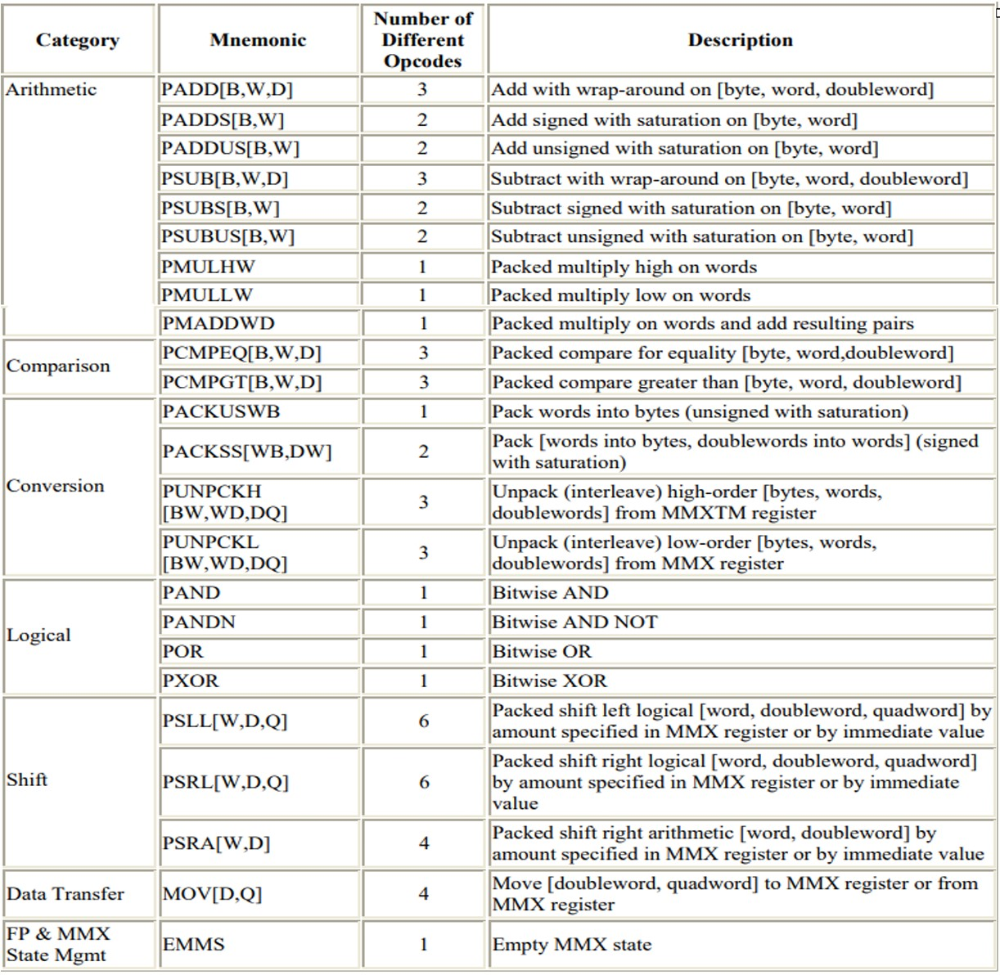
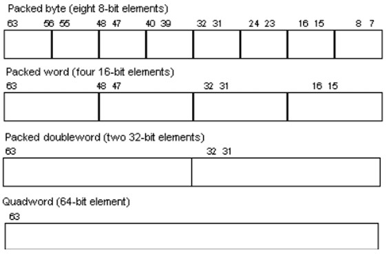
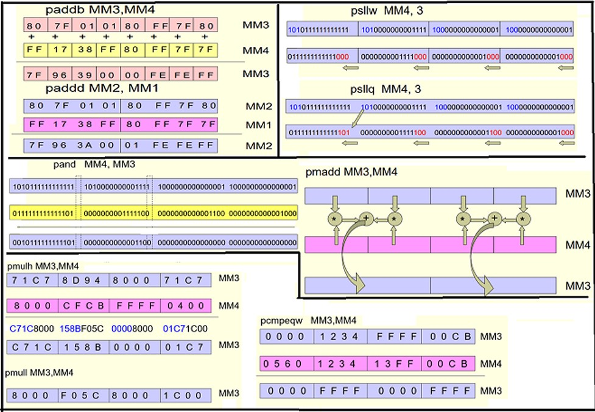
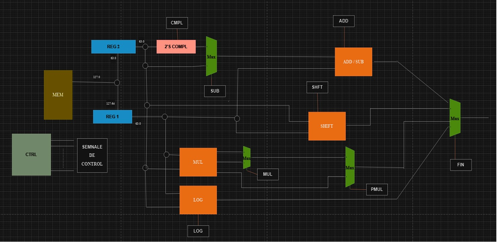
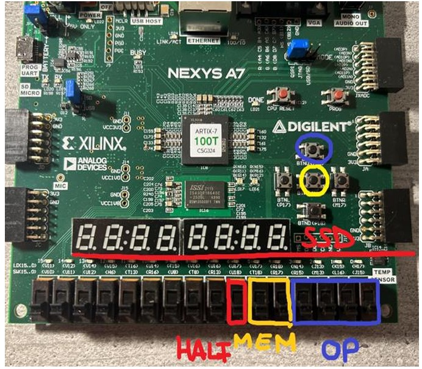
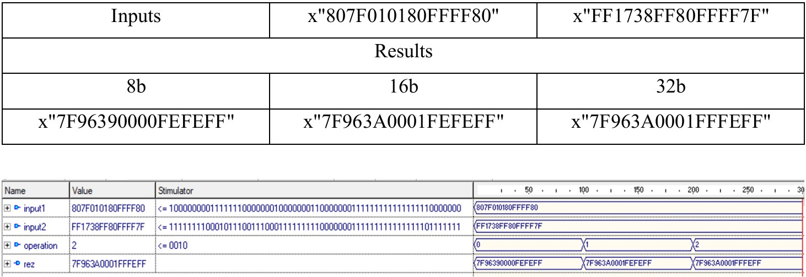
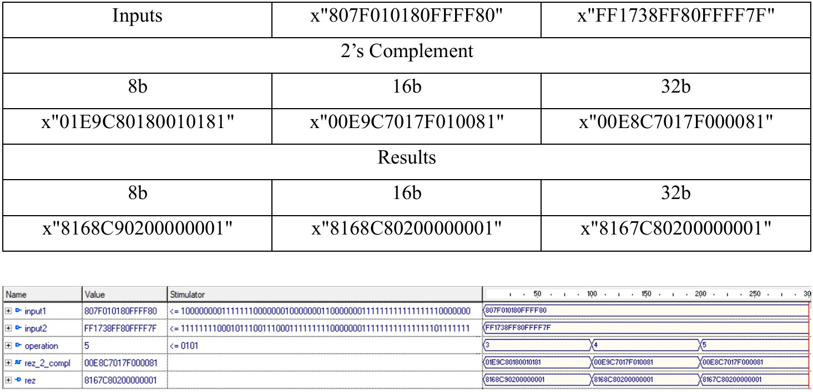
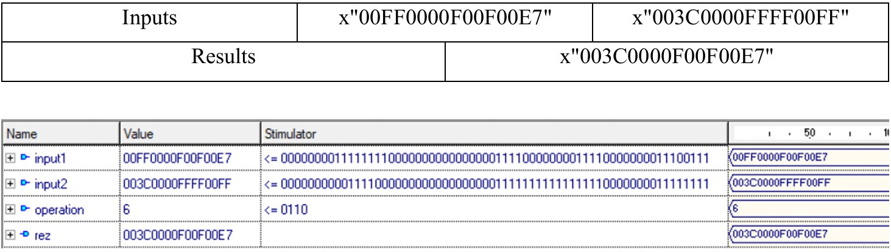
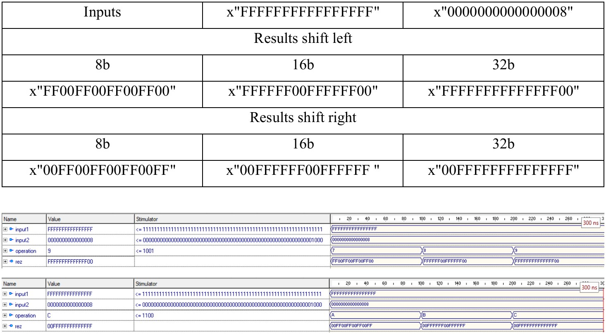
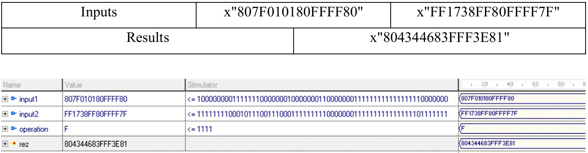

# MMX Arithmetic Unit in VHDL

This project implements a simplified **MMX-style arithmetic unit**, capable of executing 16 packed-integer SIMD operations such as addition, subtraction, logical AND, shift operations, multiplication, and multiply-add (PMADD). 

The design follows Intel's original MMX conceptual model, using 64-bit packed data and segment-based execution (8b / 16b / 32b / 64b) and is implemented on a Xilinx Nexys 7 FPGA (XC7A100TCSG324-1) using VHDL (constraints file provided)

Credit/source: Intel MMX Technology Technical Overview, 1996, https://www.intel.com/content/dam/develop/external/us/en/documents/mmx-manual-tech-overview-140701.pdf, pag. 4, 7, 8 

- List of Intel MMX Instructions 

- Data format for MMX modules

## MMX technology

MMX (Multi-Media eXtensions) is an Intel instruction set developed in 1997 to speed up multimedia tasks (audio, video, graphics) by processing multiple data elements at once using Single Instruction, Multiple Data (SIMD) techniques.

This allows one instruction to perform parallel operations, boosting performance for repetitive loops in media applications like video decoding and image editing.

- Practical examples of MMX operations with example data

## Features
- **SIMD packed operations** (byte, word, doubleword, quadword)  
- **16 MMX instructions implemented**  
- **VHDL structural design** for adder, shifter, logic unit, multiplier  
- **Static memory for operands (128-bit entries)**  
- **Control unit** handling operation decoding & signal routing  
- **FPGA-ready top-level architecture** with switches, buttons, and SSD output  
- **Matrix-based multiplier** (structural)  
- **Supports saturation/wrap-around semantics where relevant**

## Supported Instructions
**Arithmetic:**  
- `PADD` (b, w, d)  
- `PSUB` (b, w, d)

**Logical:**  
- `PAND`

**Shift:**  
- `PSLL` (w, d, q)  
- `PSRL` (w, d, q)

**Multiply:**  
- `PMULLW`  
- `PMULHW`

**Multiply–Add:**  
- `PMADDWD`

> b = 8 bits, w = 16 bits, d = 32 bits, q = 64 bits

## Architecture Overview

### Adder  
- 64-bit segmented adder built from full adders  
- Segment-based carries (8/16/32-bit groups)

### Two’s-Complement Generator  
- Segment-aware two's complement for subtraction and negative values

### Shift Unit  
- Uses `numeric_std` left/right logical shifts  
- Supports 16-bit, 32-bit, and 64-bit packed shifting

### Logical Unit  
- Supports AND on full 64-bit packed operands (can be expanded with other logical operations)

### Multiplier  
- Matrix-based structural multiplier  
- Supports:
  - PMULLW (lower 16 bits)
  - PMULHW (upper 16 bits)
  - PMADDWD (multiply + horizontal add)

### Control Unit  
- Decodes instruction  
- Enables correct datapath components  
- Selects final 64-bit result via multiplexers

### Top-Level System  
- Operands stored in 128-bit memory entries  
- Switches select instruction and memory address  
- 7-segment displays show low/high 32 bits of result  
- Ready for FPGA mapping

## How to Use (Switch & Button Tutorial)

- This section explains how to operate the MMX module on the FPGA board 

- Use the **address switches sw\[4] and sw\[5]** (yellow with "MEM" text) to choose which pair of operands to load from the 128-bit memory. Each entry contains: 64-bit operand A and 64-bit operand B 
  - `00` → x"807F010180FFFF80_FF1738FF80FFFF7F"
  - `01` → x"00FF0000F00F00E7_003C0000FFFF00FF"
  - `10` → x"FFFFFFFFFFFFFFFF_0000000000000008"
  - `11` → x"0000000000000000_0000000000000000"
- Press **btn 1** (upper - blue color) to latch the memory operands into the datapath

- Use the **instruction switches sw\[0:3]** (blue with "OP" text). Each 4-bit value maps to one of the 16 MMX instructions.  
  - “0000” = PADD (b) 
  - "0100" = PSUB (w) 
  - “0001” = PADD (w) 
  - "0010" = PADD (d) 
  - "0011" = PSUB (b) 
  - "0101" = PSUB (d) 
  - "0110" = PAND 
  - "0111" = PSLL (w) 
  - "1000" = PSLL (d) 
  - "1001" = PSLL (q) 
  - "1010" = PSRL (w) 
  - "1011" = PSRL (d) 
  - "1100" = PSRL (q) 
  - "1101" = Pmullw 
  - "1110" = Pmulhw 
  - "1111" = Pmaddw
- Press **btn 0** (middle - yellow color) to run the selected instruction

- The result is 64 bits and is shown on the **7-segment displays**. Use sw[6] (red with "HALF" text) to switch between lower 32-bits and upper 32-bits (64-bits do not fit on the 7-segment display) 

## Testing & Validation

All instructions validated through simulation:
- Packed addition/subtraction (8/16/32-bit)
- Logical AND
- Shifts
- Multiplication (low & high)
- Multiply–add

Each testbench compares RTL results with external reference values.

- Addition (8b/16b/32b)

- 2's Complement and Subtraction (8b/16b/32b)

- Logical Operation - AND (64b)

- Shift Left and Right (16b/32b/64b)

- Multiplication Pmull and Pmulh (32b)

- Multiplication and Addition Pmadd (32b)

---
